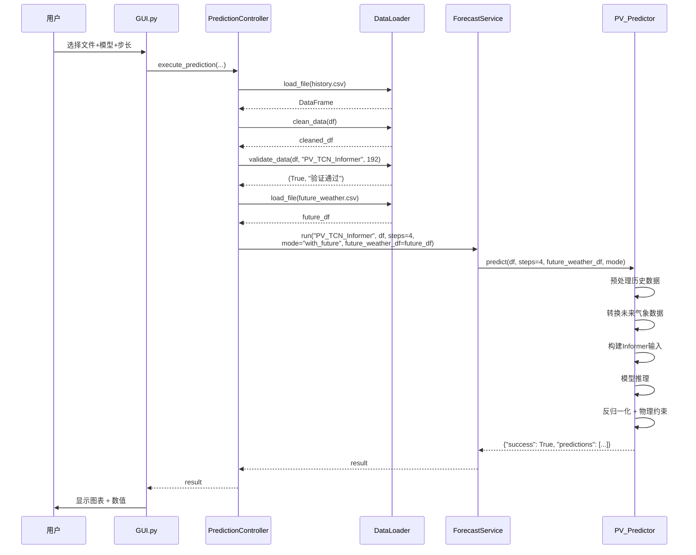

# 综合能源预测系统 - 程序架构说明

## 📐 整体架构设计

本系统采用**分层解耦架构**，将UI、业务逻辑、数据处理完全分离，便于维护和扩展。

```
┌─────────────────────────────────────────────┐
│           表现层 (Presentation)              │
│         GUI.py - Qt界面框架                  │
└────────────────┬────────────────────────────┘
                 │ 依赖注入
┌────────────────▼────────────────────────────┐
│          控制层 (Controller)                 │
│   prediction_controller.py - 业务流程编排    │
└──┬──────────────┬──────────────┬────────────┘
   │              │              │
┌──▼──────┐  ┌───▼────────┐  ┌─▼──────────┐
│数据加载器│  │图表渲染器   │  │预测服务API │
│DataLoader│  │ChartRenderer│  │ForecastSvc │
└──────────┘  └────────────┘  └─────┬──────┘
                                    │
                    ┌───────────────┼───────────────┐
                    │               │               │
            ┌───────▼──────┐ ┌─────▼──────┐ ┌─────▼──────┐
            │光伏预测器      │ │风电预测器    │ │预留扩展      │
            │PV Predictor  │ │Wind Predictor│ │...        │
            └──────────────┘ └─────────────┘ └────────────┘
```

---

## 🗂️ 模块详细说明

### 1. **GUI.py** - 用户界面层

**职责：**
- 用户交互（登录、场景选择、参数配置）
- 数据显示（图表、日志、指标卡片）
- 事件响应（按钮点击、文件选择）

**关键组件：**
```python
class EnergyForecastApp(QMainWindow):
    - controller: PredictionController      # 业务控制器
    - chart_renderer: ChartRenderer         # 图表渲染器
    - data_loader: DataLoader               # 数据加载器
    
class DataAnalysisWindow(QMainWindow):
    - 历史数据分析独立窗口
    - 功率曲线、峰值分析、质量诊断
```

**特点：**
- ✅ 无硬编码业务逻辑
- ✅ 通过控制器调用后端服务
- ✅ 支持延迟加载Matplotlib（提升启动速度）

---

### 2. **prediction_controller.py** - 业务控制层

**职责：**
- 业务流程编排（加载 → 清洗 → 验证 → 预测）
- 场景与模型映射管理
- 错误处理与结果封装

**核心方法：**
```python
class PredictionController:
    def execute_prediction(file_path, model_name, steps, ...) -> dict:
        """完整预测流程"""
        1. 加载数据 (data_loader.load_file)
        2. 清洗数据 (data_loader.clean_data)
        3. 验证数据 (data_loader.validate_data)
        4. 执行预测 (forecast_service.run)
        5. 返回结果
```

**配置管理：**
```python
# 从 gui_config.py 读取场景配置
PREDICTION_SCENARIOS = {
    "风电功率预测": {
        "models": {"CEEMDAN-LGBM-Transformer": "CEEMDAN_LGBM_Transformer"},
        "steps_options": ["下一时刻（单步）", "一小时（4 步）", ...]
    },
    "光伏功率预测": {
        "models": {
            "BP-TCN-Informer（有未来气象数据）": "PV_TCN_Informer",
            "BP-TCN-Informer（无未来气象数据）": "PV_TCN_Informer_NoWeather"
        }
    }
}
```

---

### 3. **api_v8.py** - 预测服务层

**职责：**
- 模型调度与管理
- 预测器实例化与缓存
- 统一预测接口

**核心类：**
```python
class ForecastService:
    """统一调度器"""
    - _model_registry: 模型注册表
    - _loaded_models: 实例缓存池
    - run(model_name, df, steps, **kwargs): 统一入口

class PV_TCN_Informer_Predictor:
    """光伏预测器（有未来气象数据）"""
    - preprocessor: PV_Preprocessor
    - model_wrapper: PV_ModelWrapper
    - predict(df, steps, future_weather_df, mode)

class PV_TCN_Informer_NoWeather_Predictor:
    """光伏预测器（无未来气象数据）"""
    - 使用零填充策略

class CEEMDAN_LGBM_Transformer_Predictor:
    """风电预测器"""
    - 委托给独立预处理器和模型包装器
```

**资产结构：**
```
assets/
├── pv_tcn_informer/
│   ├── assets/                    # 有未来数据版本
│   │   ├── best_tcn_informer.pth
│   │   └── preprocessor_bundle.pkl
│   ├── assets_no_weather/         # 无未来数据版本
│   │   ├── best_tcn_informer_no_weather_prediction.pth
│   │   └── preprocessor_bundle.pkl
│   ├── models/
│   │   └── pv_model_wrapper.py
│   └── preprocessors/
│       ├── pv_preprocessor.py
│       └── pv_preprocessor_no_weather_prediction.py
│
└── wind_ceemdan_lgbm_trans/
    ├── assets/
    │   ├── ensemble_models_h1_v6.pth
    │   ├── ensemble_models_h4_v6.pth
    │   ├── ensemble_models_h8_v6.pth
    │   ├── scaler_x, scaler_y
    │   └── selected_features_indices.npy
    ├── models/
    │   └── wind_model_wrapper.py
    └── preprocessors/
        └── wind_preprocessor.py
```

---

### 4. **chart_renderer.py** - 图表渲染层

**职责：**
- Matplotlib封装与配置
- 预测结果可视化（单步/多步）
- 历史数据时序曲线

**核心方法：**
```python
class ChartRenderer:
    def create_prediction_chart(values, title):
        """预测结果图表"""
        - 单步：柱状图
        - 多步：折线图 + 填充区域
    
    def create_time_series_chart(df, power_col, sample_size):
        """历史数据时序曲线"""
        - 支持采样显示
        - 自动调整布局
```

**特点：**
- ✅ 延迟加载Matplotlib（避免启动卡顿）
- ✅ 中文字体自动配置
- ✅ 可复用Canvas对象

---

### 5. **data_loader_module.py** - 数据加载层

**职责：**
- 文件格式识别（CSV/Excel）
- 数据清洗（空白行、缺失值）
- 智能列名匹配

**核心方法：**
```python
class DataLoader:
    def load_file(file_path) -> DataFrame:
        """智能加载文件"""
        - 支持 .csv, .xlsx, .xls
    
    def clean_data(df) -> (DataFrame, int):
        """数据清洗"""
        - 删除全NaN行
        - 前向/后向填充缺失值
        - 均值填补剩余NaN
    
    def validate_data(df, model_name, min_rows) -> (bool, str):
        """数据验证"""
        - 检查行数是否满足要求
        - 光伏：≥192行
        - 风电：≥96行
    
    def find_power_column(df, scenario) -> str:
        """智能查找功率列"""
        - 支持多种列名变体
    
    def find_time_column(df) -> str:
        """智能查找时间列"""
        - 精确匹配 + 模糊匹配
```

---

### 6. **gui_config.py** - 配置管理中心

**职责：**
- 集中管理所有硬编码常量
- 场景配置、样式配置、物理约束

**配置分类：**
```python
# 应用元信息
APP_NAME = "综合能源预测系统"
APP_VERSION = "V1.6"

# 预测场景配置
PREDICTION_SCENARIOS = {...}

# UI样式
COLOR_PRIMARY = "#2e7d32"
CHART_COLOR_LINE = "#00897b"

# 物理约束
PV_MAX_CAPACITY_MW = 130.0
WIND_CUT_IN_SPEED = 3.0

# 资源路径
ICON_PATH = "./res/icon.png"
BACKGROUND_PATH = "./res/background.png"
```

---

## 🔄 数据流示例

### 光伏预测流程（有未来气象数据）



---

## 🎯 设计原则

### 1. **单一职责原则 (SRP)**
- 每个模块只负责一个功能域
- GUI只处理UI，不直接操作数据
- 控制器只编排流程，不实现算法

### 2. **依赖倒置原则 (DIP)**
- 高层模块（GUI）依赖抽象（Controller接口）
- 低层模块（API）实现具体逻辑
- 通过依赖注入解耦

### 3. **开闭原则 (OCP)**
- 新增预测模型：只需在`api_v8.py`注册
- 新增预测场景：只需在`gui_config.py`配置
- 无需修改现有代码

### 4. **接口隔离原则 (ISP)**
- 预测器统一接口：`predict(df, steps, **kwargs)`
- 数据加载器统一接口：`load_file(path)`
- 图表渲染器统一接口：`create_*_chart(...)`

---

## 📊 模块依赖关系

```
GUI.py
  ├─→ prediction_controller.py
  │     ├─→ api_v8.py
  │     │     ├─→ assets/pv_tcn_informer/
  │     │     │     ├─→ preprocessors/
  │     │     │     └─→ models/
  │     │     ├─→ assets/wind_ceemdan_lgbm_trans/
  │     │     │     ├─→ preprocessors/
  │     │     │     └─→ models/
  │     │     └─→ Informer2020/
  │     ├─→ data_loader_module.py
  │     └─→ gui_config.py
  ├─→ chart_renderer.py
  │     └─→ matplotlib
  └─→ gui_config.py
```

---

## 🚀 扩展指南

### 添加新预测模型

1. **创建预测器类** (`api_v8.py`)
```python
class NewModel_Predictor:
    def __init__(self, model_dir):
        self.preprocessor = ...
        self.model_wrapper = ...
    
    def predict(self, df, steps=1, **kwargs):
        # 实现预测逻辑
        return {"success": True, "predictions": [...]}
```

2. **注册到调度器**
```python
class ForecastService:
    def __init__(self):
        self._model_registry = {
            ...
            "NewModel": (NewModel_Predictor, "new_model_folder"),
        }
```

3. **配置场景映射** (`gui_config.py`)
```python
PREDICTION_SCENARIOS["新场景"] = {
    "models": {"新模型显示名": "NewModel"},
    "steps_options": [...]
}
```

### 添加新预测场景

只需在 `gui_config.py` 中添加配置：

```python
PREDICTION_SCENARIOS["电网负荷预测"] = {
    "models": {
        "LSTM": "Load_LSTM",
        "Transformer": "Load_Transformer"
    },
    "steps_options": ["下一时刻", "未来1小时", "未来4小时"],
    "min_data_rows": 96
}
```

---

## 📝 打包注意事项

### 必须包含的文件

```python
# APredict.spec
datas = [
    ('assets', 'assets'),           # 模型资产
    ('Informer2020', 'Informer2020'), # 第三方库
    ('res', 'res'),                 # 资源文件
]

hidden_imports = [
    'assets.pv_tcn_informer.preprocessors',
    'assets.pv_tcn_informer.models',
    'assets.wind_ceemdan_lgbm_trans.preprocessors',
    'assets.wind_ceemdan_lgbm_trans.models',
    'Informer2020.models',
    'Informer2020.utils',
]
```

### 路径处理

所有资源访问使用 `resource_path()` 函数：

```python
def resource_path(relative_path):
    if hasattr(sys, '_MEIPASS'):
        return os.path.join(sys._MEIPASS, relative_path)
    return os.path.join(os.path.abspath("."), relative_path)
```

---

## 🔍 调试技巧

### 1. 启用控制台输出

修改 `APredict.spec`:
```python
console=True  # 查看print和traceback
```

### 2. 检查模块导入

```python
import sys
print("Python路径:", sys.path)
print("已加载模块:", list(sys.modules.keys()))
```

### 3. 验证资源路径

```python
from api_v8 import resource_path
print("Assets路径:", resource_path('assets'))
print("是否存在:", os.path.exists(resource_path('assets')))
```

---

## 📚 相关文档

- [打包指南](PACKAGING_GUIDE.md)
- [GUI解耦重构](FIxLogs/GUI_DECOUPLING_GUIDE.md)
- [当前状态](train/pv/B-P+T-I/CURRENT_STATUS.md)
- [实验记录](train/pv/B-P+T-I/EXPERIMENTS.md)
