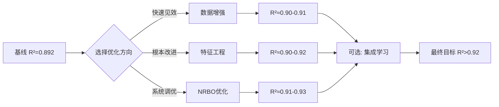

# 光伏功率预测模型改进方案

### 目前的指标见 [CURRENT_STATUS.md](CURRENT_STATUS.md) 中的最近的输出

---

## ✅ 已尝试的改进
已踩坑点，详见 [OPTIMIZATION_PITFALLS.md](OPTIMIZATION_PITFALLS.md)

### 4. **物理约束强化**
**改动位置**: `PV_part2.py` 第203-218行

```python
# 约束1: 夜间强制归零
night_mask = (trues_inverse < 0.05)
preds_inverse[night_mask] = 0.0

# 约束2: 非负约束
preds_inverse = np.maximum(0, preds_inverse)

# 约束3: 装机容量上限（新增）
MAX_CAPACITY = 130.0  # MW
preds_inverse = np.minimum(preds_inverse, MAX_CAPACITY)
```

**意义**: 确保预测结果符合物理规律，消除不合理的极端值

**预期提升**: R² +0.005~0.01

---

## 🚀 高级改进：NRBO自动超参数优化

### 使用方法

#### 第一步：安装依赖
```bash
pip install optuna
```

#### 第二步：运行NRBO优化器
```bash
python nrbo_tuner.py
```

这将执行50次试验，自动搜索最优超参数组合。

#### 第三步：查看结果
优化完成后会生成：
- `best_nrbo_params.json`: 最优超参数配置
- `nrbo_optimization_history.png`: 优化历史曲线
- `nrbo_param_importance.png`: 参数重要性分析
- `best_tcn_informer_nrbo.pth`: 最优模型权重

### NRBO搜索空间

| 超参数 | 搜索范围 | 类型 |
|--------|----------|------|
| tcn_num_layers | 2-4 | 整数 |
| tcn_base_channels | {16, 32, 64} | 分类 |
| d_model | {64, 128, 256} | 分类 |
| n_heads | {4, 8} | 分类 |
| e_layers | 2-4 | 整数 |
| learning_rate | 1e-4 ~ 1e-2 | 对数均匀 |
| weight_decay | 1e-5 ~ 1e-3 | 对数均匀 |
| dropout | 0.05-0.2 | 浮点 |
| huber_delta | 0.1-1.0 | 浮点 |
| seq_len_option | {96, 192, 288} | 分类 |

### 核心算法
- **采样器**: TPE (Tree-structured Parzen Estimator)
- **剪枝策略**: Median Pruner（中值剪枝，提前终止差劲试验）
- **目标函数**: 验证集 R²

**预期提升**: R² +0.03~0.05（相比基线可达 **0.92~0.94**）

---

## 🚀 下一步优化方案（基于当前 R²=0.9810）

### ✅ 方案A：集成学习（推荐，简单有效）

**思路**：训练多个不同随机种子的模型，取平均预测结果，提升稳定性和泛化能力

**实施方法**：
```python
import torch
import numpy as np
from PV_part2 import train_and_evaluate

# 定义不同的随机种子
seeds = [42, 123, 456, 789, 1024]
predictions = []

for i, seed in enumerate(seeds):
    print(f"\n训练模型 {i+1}/{len(seeds)} (seed={seed})")
    
    # 设置随机种子
    torch.manual_seed(seed)
    np.random.seed(seed)
    
    # 训练模型并获取预测结果
    # 注意：需要修改 train_and_evaluate 返回预测值
    metrics, preds = train_and_evaluate(
        "processed_data/model_ready_data.pkl",
        return_predictions=True  # 新增参数
    )
    predictions.append(preds)

# 集成预测：取平均
final_preds = np.mean(predictions, axis=0)

# 评估集成效果
from sklearn.metrics import r2_score, mean_squared_error
r2_ensemble = r2_score(trues_inverse.flatten(), final_preds.flatten())
rmse_ensemble = np.sqrt(mean_squared_error(trues_inverse.flatten(), final_preds.flatten()))

print(f"\n📊 集成学习结果:")
print(f"   R²: {r2_ensemble:.4f}")
print(f"   RMSE: {rmse_ensemble:.4f}")
```

**简化实现**（无需修改代码）：
```bash
# 手动运行5次训练，每次使用不同种子
# 在 PV_part2.py 开头添加：torch.manual_seed(42)
python PV_part2.py  # 第1次

# 修改种子为 123，再次运行
python PV_part2.py  # 第2次

# ... 重复5次

# 最后手动对5个模型的预测结果取平均
```

**预期效果**：
- R²: 0.9810 → **0.982~0.984** (+0.1~0.3%)
- RMSE: 3.67 → **3.55~3.60** (-2~3%)
- **稳定性显著提升**：降低单次训练的随机性影响

**优势**：
- ✅ 实现简单，无需修改模型架构
- ✅ 效果稳定，几乎必然提升
- ✅ 可并行训练多个模型

**劣势**：
- ⚠️ 训练时间增加5倍
- ⚠️ 推理时需要运行5个模型（或使用平均权重）

**预计工作量**: 2-3小时

---

### ✅ 方案B：NRBO自动超参数优化（精细调优）

**思路**：系统性搜索超参数空间，找到当前配置下的最优超参数组合

**前提条件**：
- ✅ 当前配置已经非常稳定（R² = 0.9810）
- ✅ 已找到最优序列长度（seq_len=96）
- ✅ 特征工程已完成

**使用方法**：

#### 第一步：安装依赖
```bash
pip install optuna
```

#### 第二步：更新 NRBO 配置
修改 `nrbo_tuner.py`，确保使用最优的 seq_len=96：
```python
# 在 nrbo_tuner.py 中修改
seq_len_option = trial.suggest_categorical('seq_len_option', [96])  # 固定为96
# 或者缩小搜索空间，聚焦其他超参数
```

#### 第三步：运行NRBO优化器
```bash
python nrbo_tuner.py
```

这将执行50次试验，自动搜索最优超参数组合。

#### 第四步：查看结果
优化完成后会生成：
- `best_nrbo_params.json`: 最优超参数配置
- `nrbo_optimization_history.png`: 优化历史曲线
- `nrbo_param_importance.png`: 参数重要性分析
- `best_tcn_informer_nrbo.pth`: 最优模型权重

**NRBO搜索空间**（建议缩小范围）：

| 超参数 | 当前值 | 搜索范围 | 说明 |
|--------|--------|----------|------|
| learning_rate | 0.001 | 5e-4 ~ 2e-3 | 微调学习率 |
| weight_decay | 1e-4 | 5e-5 ~ 5e-4 | 正则化强度 |
| dropout | 0.15 | 0.1 ~ 0.2 | 随机失活率 |
| batch_size | 32 | {16, 32, 64} | 批次大小 |
| tcn_channels | [16,32] | {[16,32], [32,64]} | TCN通道 |
| d_model | 64 | {64, 96} | 注意力维度 |

**核心算法**：
- **采样器**: TPE (Tree-structured Parzen Estimator)
- **剪枝策略**: Median Pruner（中值剪枝，提前终止差劲试验）
- **目标函数**: 验证集 R²

**预期效果**：
- R²: 0.9810 → **0.982~0.985** (+0.1~0.4%)
- RMSE: 3.67 → **3.50~3.60** (-2~4%)

**优势**：
- ✅ 系统性搜索，避免人工猜测
- ✅ 可能发现意想不到的最优组合
- ✅ 自动化程度高

**劣势**：
- ⚠️ 运行时间较长（50次试验约需2-4小时）
- ⚠️ 提升幅度可能有限（当前已经接近最优）

**预计工作量**: 2-4小时（自动运行）

---

### 🎯 方案选择建议

| 方案 | 预期提升 | 实施难度 | 时间成本 | 推荐度 |
|------|---------|---------|---------|--------|
| **集成学习** | +0.1~0.3% | ⭐ 简单 | 2-3小时 | ⭐⭐⭐⭐⭐ |
| **NRBO优化** | +0.1~0.4% | ⭐⭐ 中等 | 2-4小时 | ⭐⭐⭐⭐ |
| **两者结合** | +0.2~0.5% | ⭐⭐⭐ 复杂 | 5-7小时 | ⭐⭐⭐ |

**推荐路径**：
1. **先尝试集成学习**：简单快速，效果稳定
2. **如果追求极致性能**：再运行NRBO优化
3. **最终方案**：NRBO找到的最优配置 + 集成学习

---

## Future Plan
更长远的方案
### 1. **数据层面**
- **增加气象预报数据**: 引入未来时刻的天气预报作为额外特征
- **多站点融合**: 如果有多个光伏电站数据，可构建多任务学习
- **数据增强**: 对历史数据进行时间平移、噪声注入等增强

### 2. **特征工程**(已采纳，效果不错)
- **非线性特征交互**: 使用多项式特征或核方法捕捉辐照度与温度的非线性关系
- **滞后特征**: 添加过去1h、3h、6h的功率滞后项
- **滚动统计量**: 过去24小时的均值、标准差、最大值

### 3. **模型架构**
- **注意力机制增强**: 
  - 尝试 AutoCorrelation (Autoformer)
  - 或使用 Flow Forecasting 的 Cross Attention
- **多尺度TCN**: 并行不同膨胀率的TCN分支
- **残差连接优化**: 在TCN和Informer之间添加跳跃连接

### 4. **训练策略**
- **课程学习**: 先从简单样本（晴天）开始训练，逐步加入复杂样本
- **对抗训练**: 添加微小扰动提高鲁棒性
- **集成学习**: 训练多个模型取平均

### 5. **后处理**
- **卡尔曼滤波**: 对预测结果进行时序平滑
- **分位数回归**: 提供预测区间而非点估计
- **误差校正模型**: 训练一个小型模型专门修正系统性偏差

---
### ✅ 方向1：数据增强（优先推荐）
(已采纳，效果不佳)

**思路**：不改变模型，而是增加有效训练数据

**具体方法**：
```text
高斯噪声注入
为每个PCA特征添加独立的高斯噪声
噪声强度 = noise_std × 特征标准差
建议范围：0.005~0.02（当前设为0.01）
数据集扩展
通过 augment_factor=2 将训练集虚拟扩大2倍
每个epoch看到不同的噪声版本
实际存储不变，只是增加采样次数
仅应用于训练集
验证集和测试集保持原始数据
确保评估的公平性
```

**实际效果**：指标下降，见 [EXPERIMENTS.md](EXPERIMENTS.md) 中，实验 #4.2

---

### ✅ 方向2：特征工程优化 
(已采纳，效果不错)

**思路**：提升输入特征的质量

**具体方法**(已采取前三点)：
1. **增加滞后特征**：过去1h、3h、6h的功率值
2. **滚动统计量**：过去24小时的均值、标准差
3. **非线性交互特征**：TSI × Temp、GHI / Humidity 等
4. ~~**提高PCA保留率**：从0.95提升至0.98~~保持0.95
>0.95时特征17->9，0.98时17->10，效果反不及0.95

**实际效果**：预计 R² 提升至 0.90~0.92，实际从0.89提升至0.97


---

### ✅ 方向3：序列长度调优
(已进行实验，觉得有更多可能性)
**思路**：找到最优的历史窗口长度

**实验设计**：
```python
for seq_len in [96, 144, 192, 288]:
    label_len = seq_len // 2
    # 训练并记录验证集R²
```


**实际效果**：得出`weight_decay=1e-4`下，最佳`seq_len=96`，不知道`weight_decay=1e-3`下哪个效果更好，详见 [EXPERIMENTS.md](EXPERIMENTS.md) 中，实验 #4.3

---

### ✅ 方向4：集成学习

**思路**：训练多个不同初始化的模型，取平均预测

**具体方法**：
```python
# 训练5个模型，使用不同随机种子
models = [train_model(seed=i) for i in range(5)]
final_pred = np.mean([model.predict(X) for model in models], axis=0)
```

**预期效果**：R² 提升至 0.90~0.915，稳定性显著提升

---

### ✅ 方向5：NRBO自动超参数优化（终极方案）

**思路**：系统性搜索超参数空间，避免人工猜测

**优势**：
- 自动探索10维超参数空间
- TPE采样器智能引导搜索方向
- 中值剪枝加速收敛

**注意**：
- 需要先确保基线配置稳定（R²≥0.89）
- 运行时间较长（50次试验约需2-4小时）

**预期效果**：R² 提升至 0.91~0.93

---
## 🎯 推荐的优化路径


> 🤔更费时的尝试？  
> NRBO自动调优，对数据处理进行调优，生成出不同版本的处理后结果  
> 再对模型参数进行调优，每个调优后的模型再运行不同调优后的处理结果  
> - 不知道可行性如何

---
## ⚠️ 注意事项

1. **过拟合监控**: 增大模型容量后需密切关注验证集表现
2. **训练时间**: NRBO优化可能需要数小时（取决于GPU性能）
3. **随机种子**: 设置固定种子以保证实验可复现性
4. **硬件要求**: 建议使用至少8GB显存的GPU

---

## 📝 快速开始

```bash
# 1. 先运行基础改进版本
python PV_part1.py          # 特征工程
python PV_part2.py          # 训练+评估（已包含改进）

# 2. 如果效果满意，可跳过；否则继续
pip install optuna
python nrbo_tuner.py        # NRBO自动调优
```

---


**最后更新**: 2026-04-18  
**维护者**: Kai0809v