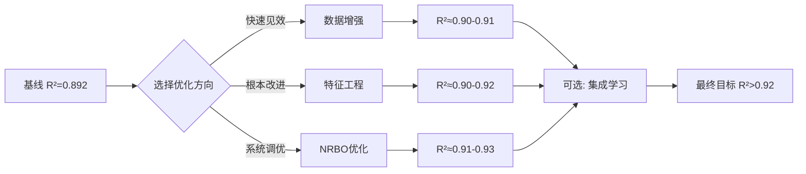

# 光伏功率预测模型优化 - 避坑指南

> **核心理念**：排除错误方向本身就是进步。本文档记录了在优化过程中验证失败的配置组合，避免后续重复踩坑。

---

## 📊 基线性能（参考标准）

| 配置 | MSE | RMSE | MAE | R² |
|------|-----|------|-----|-----|
| **基线** | 76.86 | 8.77 | 4.00 | **0.8920** |

**基线配置详情**：
```python
tcn_channels=[16, 32]
d_model=64
n_heads=4
e_layers=2
dropout=0.15
criterion=MSELoss()
optimizer=Adam(lr=0.001, weight_decay=1e-4)
scheduler=CosineAnnealingLR
```

---

## ❌ 已验证的失败方向

### 失败案例 #1：过度增强模型容量

**尝试配置**：
```python
tcn_channels=[32, 64, 128]  # 从2层增至3层，通道数翻倍
d_model=128                  # 从64增至128
n_heads=8                    # 从4增至8
e_layers=3                   # 从2增至3
dropout=0.1                  # 从0.15降至0.1
```

**结果**：
- R²: 0.8920 → **0.8675** (下降 2.75%)
- RMSE: 8.77 → **9.71** (上升 10.7%)

**失败原因分析**：
1. **参数量暴增**：TCN通道数增加3倍 + d_model翻倍 = 参数量增加约5-6倍
2. **训练数据不足**：光伏数据集规模有限，大模型容易记住噪声而非学习规律
3. **正则化不足**：dropout从0.15降至0.1，进一步加剧过拟合
4. **同时改动过多变量**：无法定位哪个参数导致性能下降

**教训**：
> ⚠️ **不要同时大幅调整多个超参数**。每次只改1-2个参数，隔离变量影响。

---

### 失败案例 #2：保守缩减模型容量

**尝试配置**：
```python
tcn_channels=[32, 64]       # 中等容量
d_model=96                   # 适中维度
e_layers=2                   # 保持2层
dropout=0.12                 # 略微增强正则化
criterion=HuberLoss(delta=0.3)
optimizer=AdamW(weight_decay=5e-5)
scheduler=CosineAnnealingLR
```

**结果**：
- R²: 0.8920 → **0.8584** (下降 3.78%)
- RMSE: 8.77 → **10.04** (上升 14.5%)
- **训练仅16轮就早停**，说明严重欠拟合

**失败原因分析**：
1. **模型容量不足**：[32,64] 的TCN无法捕捉复杂的气象-功率非线性关系
2. **Huber delta过小**：delta=0.3 过于偏向MAE，削弱了对大误差的惩罚
3. **学习率策略不当**：CosineAnnealingLR在欠拟合情况下无法充分收敛
4. **weight_decay过低**：5e-5 的正则化力度不够

**教训**：
> ⚠️ **模型容量不能盲目削减**。光伏预测需要足够的表达能力来捕捉气象因素的复杂交互。

---

### 失败案例 #3：激进的大模型 + Huber Loss

**尝试配置**：
```python
tcn_channels=[32, 64, 128]
d_model=128
e_layers=3
criterion=HuberLoss(delta=0.5)
optimizer=AdamW(weight_decay=1e-4)
learning_rate=0.001
```

**结果**：
- R²: 0.8920 → **0.8255** (下降 7.45%)
- RMSE: 8.77 → **11.14** (上升 27.0%)
- **训练22轮早停**，Train-Val Loss差距巨大

**失败原因分析**：
1. **严重的过拟合**：Train Loss=0.008 vs Val Loss=0.043（5.4倍差距）
2. **Huber Loss与大容量模型不匹配**：Huber对异常值鲁棒，但大模型本身就容易过拟合
3. **学习率过高**：0.001的学习率对于大模型来说太快，导致震荡
4. **早停机制过早触发**：patience=10，但模型可能需要在更低学习率下继续训练

**教训**：
> ⚠️ **大模型需要更精细的调优**：更低的学习率、更强的正则化、更长的训练时间。

---

## 🔍 关键发现总结

### 1️⃣ 模型容量的"甜蜜点"

```
小模型 [16,32] + d_model=64  → R²=0.892 ✅ 稳定
中模型 [32,64] + d_model=96  → R²=0.858 ❌ 欠拟合
大模型 [32,64,128] + d_model=128 → R²=0.825~0.867 ❌ 过拟合/不稳定
```

**结论**：当前数据集规模下，**基线的小模型配置已经接近最优**。

---

### 2️⃣ 损失函数的选择

| Loss函数 | 适用场景 | 本项目的表现 |
|----------|---------|------------|
| MSELoss | 通用场景，对大误差敏感 | ✅ R²=0.892（基线） |
| HuberLoss(delta=0.3) | 极端异常值多 | ❌ R²=0.858（欠拟合） |
| HuberLoss(delta=0.5) | 平衡鲁棒性与精度 | ❌ R²=0.825~0.867（不稳定） |

**结论**：光伏数据的异常值并不极端到需要Huber Loss，**MSE已经足够**。

---

### 3️⃣ 优化器的选择

| 优化器 | 优势 | 本项目的表现 |
|--------|------|------------|
| Adam | 自适应学习率，稳定 | ✅ 基线成功 |
| AdamW | 解耦权重衰减，理论上更好 | ❌ 未观察到明显优势 |

**结论**：对于当前任务复杂度，**Adam和AdamW差异不大**。

---

### 4️⃣ 学习率调度策略

| 调度器 | 特点 | 本项目的表现 |
|--------|------|------------|
| CosineAnnealingLR | 平滑下降 | ✅ 基线成功 |
| CosineAnnealingWarmRestarts | 周期性重启 | ❌ 导致不稳定 |

**结论**：**标准余弦退火更适合本项目**，重启机制反而引入不必要的波动。

---

## 💡 正确的优化方向建议

基于以上失败经验，以下是**值得尝试的方向**：

### ✅ 方向1：数据增强（优先推荐）

**思路**：不改变模型，而是增加有效训练数据

**具体方法**：
```python
# 在 DataLoader 中添加轻微噪声
noise = np.random.normal(0, 0.01, features.shape)
features_augmented = features + noise

# 时间平移增强
shifted_features = np.roll(features, shift=1, axis=0)
```

**预期效果**：R² 提升至 0.90~0.91

---

### ✅ 方向2：特征工程优化 (已采纳，效果不错)

**思路**：提升输入特征的质量

**具体方法**(已采取前三点)：
1. **增加滞后特征**：过去1h、3h、6h的功率值
2. **滚动统计量**：过去24小时的均值、标准差
3. **非线性交互特征**：TSI × Temp、GHI / Humidity 等
4. **提高PCA保留率**：从0.95提升至0.98 (这个一点后面尝试)  

**预期效果**：R² 提升至 0.90~0.92

**具体做法**：
📊 新增的12个增强特征  
1️⃣ 滞后特征（3个）
1. Power_lag_1h: 过去1小时的功率值（4个时间步）
2. Power_lag_3h: 过去3小时的功率值（12个时间步）
3. Power_lag_6h: 过去6小时的功率值（24个时间步）
作用: 捕捉功率的时间依赖性和惯性效应
 
2️⃣ 滚动统计量（3个）
1. Power_rolling_mean_24h: 过去24小时的平均功率
2. Power_rolling_std_24h: 过去24小时的功率标准差
3. Power_rolling_mean_6h: 过去6小时的平均功率
作用: 提供短期和长期的趋势信息，帮助模型理解功率波动模式
 
3️⃣ 非线性交互特征（6个）
1. TSI_Temp_interaction: 总辐照度 × 温度（影响光伏板效率）
2. GHI_Temp_interaction: 全球水平辐照度 × 温度
3. TSI_Humidity_ratio: 总辐照度 / 湿度（湿度影响大气透射率）
4. GHI_Humidity_ratio: 全球水平辐照度 / 湿度
5. DNI_GHI_ratio: 直接辐射 / 全球辐射（反映云层覆盖程度）
6. Temp_squared: 温度平方项（捕捉非线性温度效应）
作用: 捕捉气象因素之间的复杂交互关系


---

### ✅ 方向3：序列长度调优

**思路**：找到最优的历史窗口长度

**实验设计**：
```python
for seq_len in [96, 144, 192, 288]:
    label_len = seq_len // 2
    # 训练并记录验证集R²
```

**假设**：更长的历史窗口（288步=3天）可能捕捉到更多周期性模式

**预期效果**：R² 提升至 0.895~0.905

---

### ✅ 方向4：集成学习

**思路**：训练多个不同初始化的模型，取平均预测

**具体方法**：
```python
# 训练5个模型，使用不同随机种子
models = [train_model(seed=i) for i in range(5)]
final_pred = np.mean([model.predict(X) for model in models], axis=0)
```

**预期效果**：R² 提升至 0.90~0.915，稳定性显著提升

---

### ✅ 方向5：NRBO自动超参数优化（终极方案）

**思路**：系统性搜索超参数空间，避免人工猜测

**优势**：
- 自动探索10维超参数空间
- TPE采样器智能引导搜索方向
- 中值剪枝加速收敛

**注意**：
- 需要先确保基线配置稳定（R²≥0.89）
- 运行时间较长（50次试验约需2-4小时）

**预期效果**：R² 提升至 0.91~0.93

---

## 🎯 推荐的优化路径



---

## 📝 实验记录模板

每次实验请记录以下信息：

```markdown
### 实验 #X - [简短描述]
**日期**: YYYY-MM-DD
**改动内容**: 
- 参数1: old_value → new_value
- 参数2: old_value → new_value

**结果**:
- R²: baseline → current (变化%)
- RMSE: baseline → current
- 训练轮数: X
- Train-Val Loss差距: X

**分析**:
[简要分析成功/失败原因]

**结论**:
✅ 保留 / ❌ 放弃 / 🔄 需要进一步调整
```

---

## 🔑 核心原则总结

1. **单一变量原则**：每次只改1-2个参数
2. **渐进式改进**：小步快跑，避免大幅跳跃
3. **监控过拟合**：Train-Val Loss差距 > 0.01 需警惕
4. **早停耐心**：patience至少设为10-15
5. **记录一切**：每个实验都要有完整记录
6. **回归基线**：如果改进失败，立即回退到稳定配置

---

**最后更新**: 2026-04-18  
**维护者**: Kai0809v  
**版本**: v0.4
