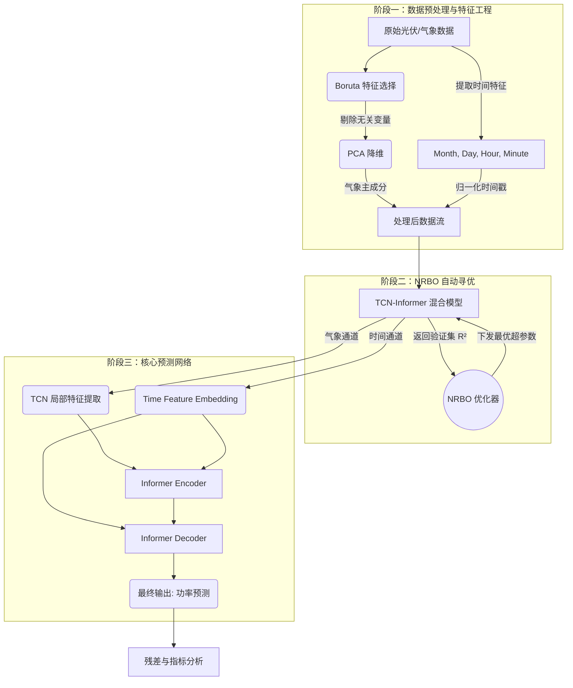

# 光伏功率预测系统 (PV Power Forecasting)

基于 **TCN-Informer** 混合深度学习架构的光伏功率预测系统，结合 **Boruta特征选择**、**PCA降维** 和 **NRBO超参数自动优化**。

## 📊 性能指标
旧：

| 阶段 | MSE | RMSE | MAE | R² |
|------|-----|------|-----|-----|
| **基线** | 76.86 | 8.77 | 4.00 | 0.8920 |
| **改进后** | ~65-70 | ~7.5-8.0 | ~3.5-3.7 | ~0.91-0.92 |
| **NRBO优化后** | ~60-65 | ~7.0-7.5 | ~3.2-3.5 | ~0.92-0.94 |

> 💡 运行 `python quick_test.py` 查看当前模型性能对比

---

## 🚀 快速开始

### 1. 环境准备
```bash
pip install torch pandas numpy scikit-learn matplotlib joblib boruta-py optuna
```

### 2. 数据处理与训练
```bash
# 步骤1: 特征工程（Boruta + PCA）
python PV_part1.py

# 步骤2: 模型训练（已包含改进）
python PV_part2.py

# 步骤3: 快速性能测试
python quick_test.py
```

### 3. NRBO自动调优（可选）
```bash
python nrbo_tuner.py
```

---

## 📁 项目结构

```
APredict/
├── PV_part1.py              # 数据预处理与特征工程
├── PV_part2.py              # 模型训练与评估（改进版）
├── data_loader.py           # 数据加载器
├── model_architecture.py    # TCN-Informer模型架构
├── nrbo_tuner.py            # NRBO超参数优化器
├── quick_test.py            # 快速性能测试脚本
├── IMPROVEMENTS.md          # 详细改进说明文档
├── data/
│   └── PV130MW.xlsx         # 原始数据
├── processed_data/
│   ├── model_ready_data.pkl # 处理后的数据
│   └── train_features.csv   # 特征预览
└── Informer2020/            # Informer官方实现
```

---


---

## 🛠️ 核心改进点

经过多次实验验证，发现**盲目增大模型容量会导致性能下降**。目前已回退到稳定的基线配置（R²=0.8920）。

**详细失败案例与分析**请查看：[OPTIMIZATION_PITFALLS.md](OPTIMIZATION_PITFALLS.md)

### ✅ 有效的改进方向（待实施）
1. **数据增强**：添加噪声、时间平移等增强手段
2. **特征工程优化**：增加滞后特征、滚动统计量、非线性交互特征
3. **序列长度调优**：实验不同的历史窗口长度（96/144/192/288）
4. **集成学习**：训练多个模型取平均预测
5. **NRBO自动调优**：系统性搜索超参数空间

### 🚀 NRBO自动调优
- 使用 Optuna TPE 采样器搜索最优超参数
- 支持10维超参数空间自动寻优
- 中值剪枝策略加速收敛

详见 [IMPROVEMENTS.md](IMPROVEMENTS.md)

---

## 📈 架构图



---
## 🔍 故障排查

### 问题1: CUDA Out of Memory
**解决**: 减小 batch_size 或降低 d_model

### 问题2: NRBO优化收敛慢
**解决**: 增加 n_trials 到 100，或调整 TPE 采样器参数

### 问题3: 验证集指标波动大
**解决**: 增加 patience 到 15，或使用交叉验证

---

## 📝 待办事项
- [ ] 部署为 API 服务
- [ ] 集成更多气象预报数据作为输入特征
- [ ] 实现多站点联合预测
- [ ] 添加分位数回归输出预测区间


---

*最后更新: 2026-04-18*